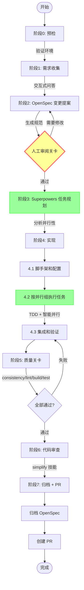
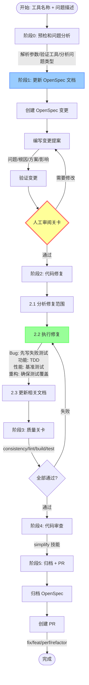

# 工具盒子

一个基于 Monorepo 的在线工具平台。当前项目已经进入 `200+` 工具规模，前端保持统一壳层，新增工具按 `manifest + 工具内 i18n + ui-kit 复用` 的标准接入，后端通过 `api-gateway + legacy bridge` 渐进演进。

## 快速开始

```bash
pnpm install
pnpm dev
```

默认打开 `http://localhost:3000`。

## 常用命令

| 命令 | 说明 |
|------|------|
| `pnpm dev` | 启动前端开发环境 |
| `pnpm dev:api` | 启动 `apps/api-gateway` |
| `pnpm dev:full` | 同时启动前端和网关 |
| `pnpm build` | 构建前端 |
| `pnpm build:backend` | 构建 `api-gateway` |
| `pnpm start` | 启动兼容入口 `server.js` |
| `pnpm start:api` | 直接启动 `apps/api-gateway` |
| `pnpm test` | 运行前端单测 |
| `pnpm test:e2e` | 运行 Playwright E2E |

## 当前结构

```text
toolbox/
├── apps/
│   ├── web/                 # 主前端壳层
│   └── api-gateway/         # 新后端入口
├── packages/
│   ├── ui-kit/              # 公共 UI 组件
│   ├── tool-registry/       # manifest 标准
│   ├── i18n-runtime/        # 工具级按需国际化
│   └── service-core/        # 服务模块基础能力
├── services/
│   └── legacy-tools-service/# 老服务兼容桥
├── tools/                   # 独立工具包
└── docs/                    # 活跃文档与归档
```

## 工具开发工作流

### 新工具创建流程 (`/create-tools`)



**关键特性：**
- 文档驱动：OpenSpec 变更提案 + 人工审阅关卡
- 智能并行：Superpowers 分析任务依赖，按并行组派遣多个子代理
- TDD 原则：先写测试，再实现，后重构
- 自动化验证：质量关卡 + 代码审查（simplify）

**举例用法：**

```bash
# 示例 1：创建一个 DNS 查询工具
/create-tools dns-query

# 示例 2：创建一个 IP 地址计算器
/create-tools ip-calculator

# 示例 3：创建一个 JSON 格式化工具
/create-tools json-formatter
```

**交互流程示例：**
```
用户: /create-tools dns-query

AI: [阶段 0 预检通过]
    
    [阶段 1 需求收集]
    请回答以下问题：
    1. 这个工具做什么？
       → 查询域名的 DNS 记录（A、AAAA、MX、TXT 等）
    2. 谁使用它以及何时使用？
       → 开发者和运维人员在调试域名解析问题时使用
    3. 输入和输出？
       → 输入：域名 + 记录类型；输出：DNS 记录列表
    4. 需要后端吗？
       → yes-light（需要调用 DNS 查询 API）
    5. 参考工具？
       → tools/tool-whois（类似的查询工具）
    6. 分类？
       → dns
    
    [阶段 2 生成 OpenSpec 变更提案...]
    [阶段 3 Superpowers 任务规划...]
    [阶段 4 开始实现，派遣 3 个并行子代理...]
    [阶段 5-7 质量验证、审查、PR...]
```

### 工具修复流程 (`/fix-tool`)



**关键特性：**
- 文档优先：先更新 OpenSpec，确保文档和代码同步
- 测试驱动：Bug 修复先写失败测试，功能增强遵循 TDD
- 最小化修改：只改必要的部分，避免不相关的重构
- 清晰追溯：OpenSpec 记录问题、根因、方案、影响

**举例用法：**

```bash
# 示例 1：修复 Bug
/fix-tool screen-recorder 录制时音频不同步

# 示例 2：功能增强
/fix-tool json-formatter 添加 YAML 格式支持

# 示例 3：性能优化
/fix-tool image-compressor 优化大图片处理速度

# 示例 4：代码重构
/fix-tool dns-query 重构查询逻辑提高可维护性
```

**交互流程示例：**
```
用户: /fix-tool screen-recorder 录制时音频不同步

AI: [阶段 0 预检和问题分析]
    - 工具名称: screen-recorder
    - 问题描述: 录制时音频不同步
    - 问题类型: Bug 修复
    - 相关文件: tools/tool-screen-recorder/src/Recorder.tsx
    
    [阶段 1 更新 OpenSpec 文档]
    创建变更: openspec/changes/fix-screen-recorder-audio-sync/
    - proposal.md: 
      * 问题: 音频和视频时间戳不一致
      * 根因: MediaRecorder 配置缺少时间同步参数
      * 方案: 添加 audioBitsPerSecond 和 videoBitsPerSecond 配置
    
    🧑 人工关卡 — 请审阅修复方案，通过 / 需要修改？
    
用户: 通过

AI: [阶段 2 代码修复]
    1. 添加失败测试: 验证音视频时间戳差异 < 100ms
    2. 修改 Recorder.tsx: 添加同步配置
    3. 测试通过 ✓
    
    [阶段 3 质量关卡] 全部通过 ✓
    [阶段 4 代码审查] simplify 应用完成 ✓
    [阶段 5 归档 + PR] PR #123 已创建
```

## 文档入口

| 文档 | 用途 |
|------|------|
| [docs/README.md](docs/README.md) | 文档总索引，先看这里 |
| [docs/TOOLS_ROADMAP.md](docs/TOOLS_ROADMAP.md) | 工具已开发 / 待开发唯一权威清单 |
| [docs/ROADMAP_CONVENTION.md](docs/ROADMAP_CONVENTION.md) | 如何新增规划、更新状态、避免重复 |
| [docs/refactor-structure.md](docs/refactor-structure.md) | 当前开发命令、目录职责、日常开发流程 |
| [docs/TOOL_LANDING.md](docs/TOOL_LANDING.md) | 新工具落地标准与接入清单 |
| [MIGRATION_GUIDE.md](MIGRATION_GUIDE.md) | 老模块按新标准渐进迁移的入口说明 |
| [ARCHITECTURE.md](ARCHITECTURE.md) | 架构总览入口 |
| [ROADMAP.md](ROADMAP.md) | 路线图总览入口 |
| [TOOLS_LIST.md](TOOLS_LIST.md) | 对外/产品视角的工具目录入口 |

## 文档维护约定

- 工具状态和代码落位只在 [docs/TOOLS_ROADMAP.md](docs/TOOLS_ROADMAP.md) 维护。
- 根目录的 [ARCHITECTURE.md](ARCHITECTURE.md)、[ROADMAP.md](ROADMAP.md)、[TOOLS_LIST.md](TOOLS_LIST.md) 只保留高层概览，不再维护逐项细节。
- 阶段性统计、批次记录和历史分析放进 `docs/archive/`，不再与活跃文档混放。

## 许可证

MIT
