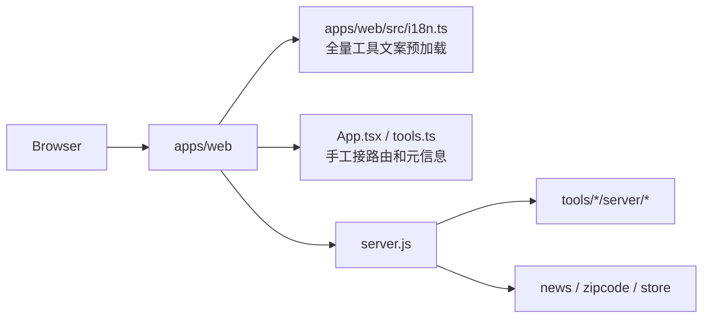
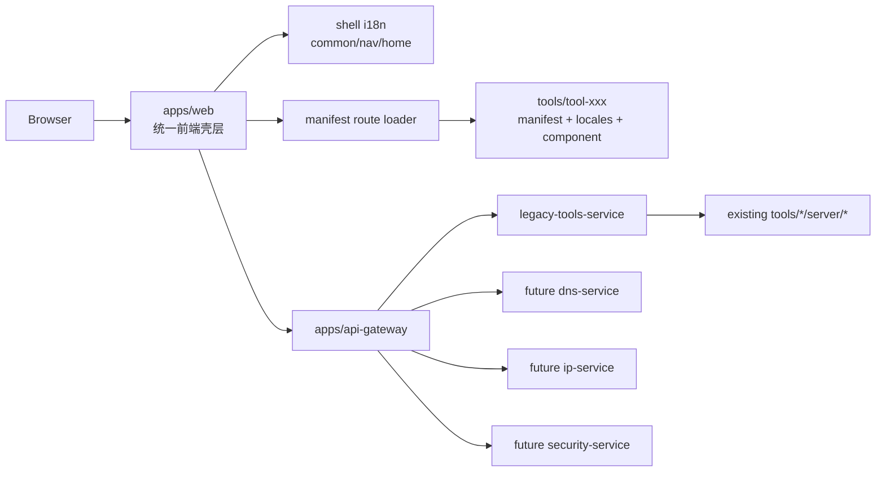
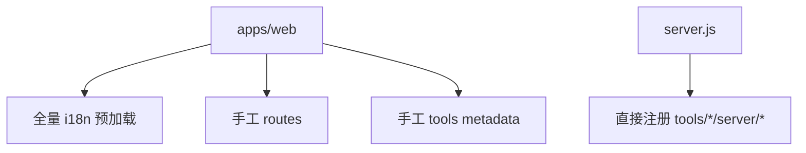
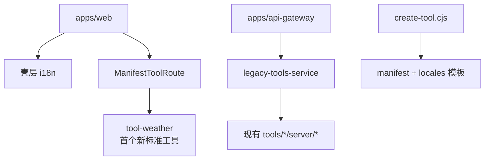
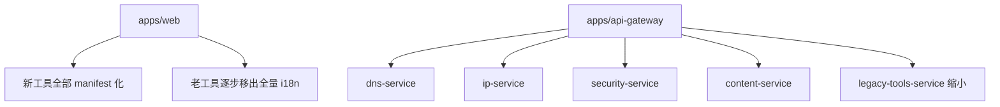
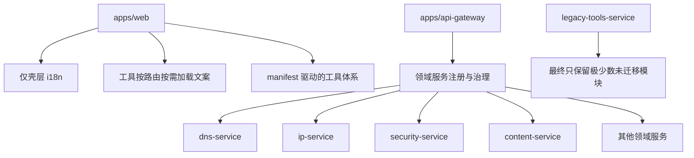

# Toolbox 架构对比与迁移阶段图

## 当前态 vs 目标态

### 当前态

- 前端是单壳层应用，但工具接线主要依赖手工维护。
- `apps/web/src/i18n.ts` 预加载大量工具文案，工具越多，首屏和维护成本越高。
- 根上的 `server.js` 直接手工注册大量 `tools/*/server/*` 路由。
- 后端没有明确的服务边界，能力按工具散落，复用和演进成本高。
- 新工具接入流程不统一，脚手架没有强制 manifest 和工具级 i18n。

### 目标态

- 前端仍然保留单壳层应用，维持统一导航、搜索和主题。
- 新工具通过 `tool.manifest.ts` 接入，元信息、组件入口和文案加载方式统一。
- 工具文案默认保留在工具目录内，路由进入时按需加载 namespace。
- 后端统一走 `api-gateway`，再按领域服务注册和转发。
- 老工具先通过兼容桥运行，逐步从桥中迁出到领域服务。

## 模块边界对比

| 维度 | 当前态 | 目标态 |
| --- | --- | --- |
| 前端入口 | `apps/web` | `apps/web` |
| 工具注册 | `App.tsx` + `config/tools.ts` 手工维护 | `tool.manifest.ts` 为主，壳层做轻量注册 |
| 工具文案 | 主应用集中预加载 | 工具目录内自管，按需加载 |
| 公共 UI | 已有 `ui-kit`，但标准不够硬 | 继续收敛到 `ui-kit`，新工具必须复用 |
| 后端入口 | 根 `server.js` | `apps/api-gateway` |
| 服务组织 | 路由散落在 `tools/*/server/*` | 领域服务放在 `services/*` |
| 旧模块兼容 | 无显式兼容层 | `legacy-tools-service` 作为桥接层 |
| 新工具脚手架 | 只生成基础组件 | 强制生成 manifest + locales |

## 迁移阶段图

### 阶段 0：历史状态

### 阶段 1：当前已落地状态

### 阶段 2：过渡目标

### 阶段 3：最终目标

## 建议执行顺序

1. 所有新工具从现在开始强制按新标准开发。
2. 新增服务端能力优先落到 `services/*`，不要再直接堆进旧兼容桥。
3. 老工具优先迁移 DNS、IP、安全三组，因为复用最高。
4. 等迁移覆盖率足够后，再逐步精简 `apps/web/src/i18n.ts` 和旧手工路由接线。

## 对团队的约束建议

- 新增工具必须包含 `tool.manifest.ts`
- 新增工具必须包含 `src/locales/zh.json` 和 `src/locales/en.json`
- 新增通用组件必须先进入 `ui-kit`
- 新增服务端工具不得直接修改根 `server.js`
- 老模块迁移优先做“复制兼容，再删除旧入口”，不要直接硬切

